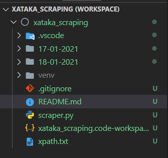

# Geek Magazine Scraping

Creating a code to Scraping a Geek Magazine (everyday), getting tittle and body of all the articles and save it in separate .txt files

# Languages

  - Python
  - XPath

# ScreenShoots
  - 